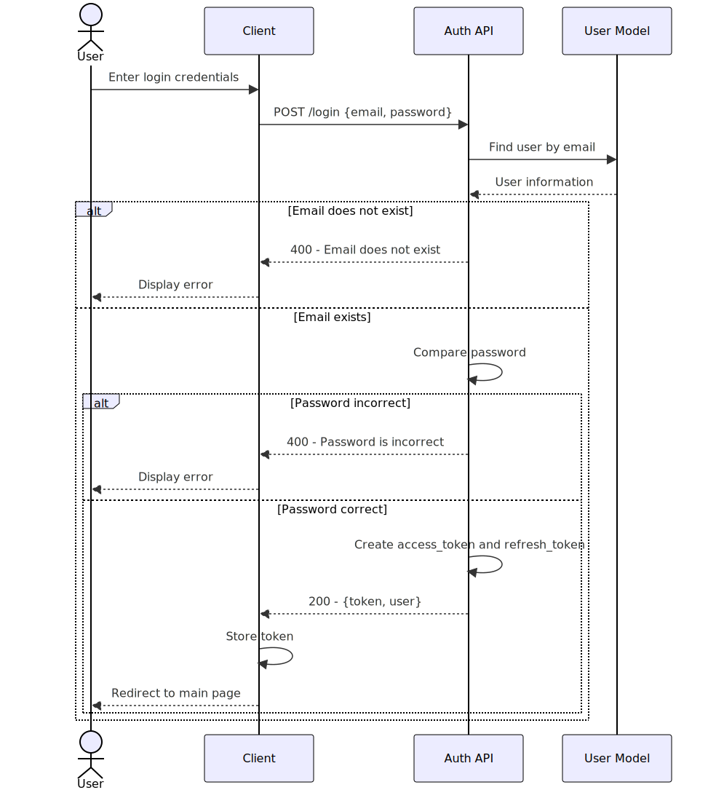
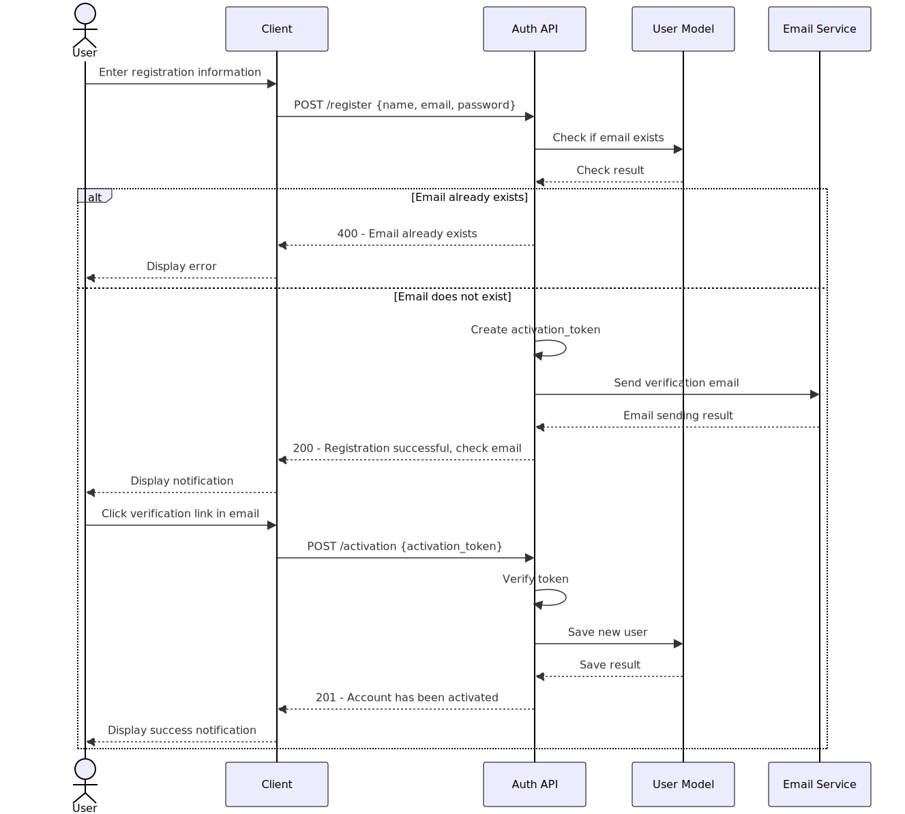
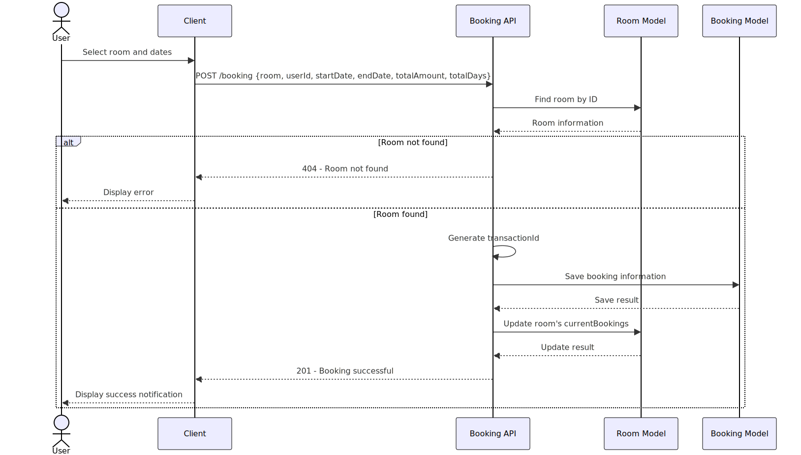
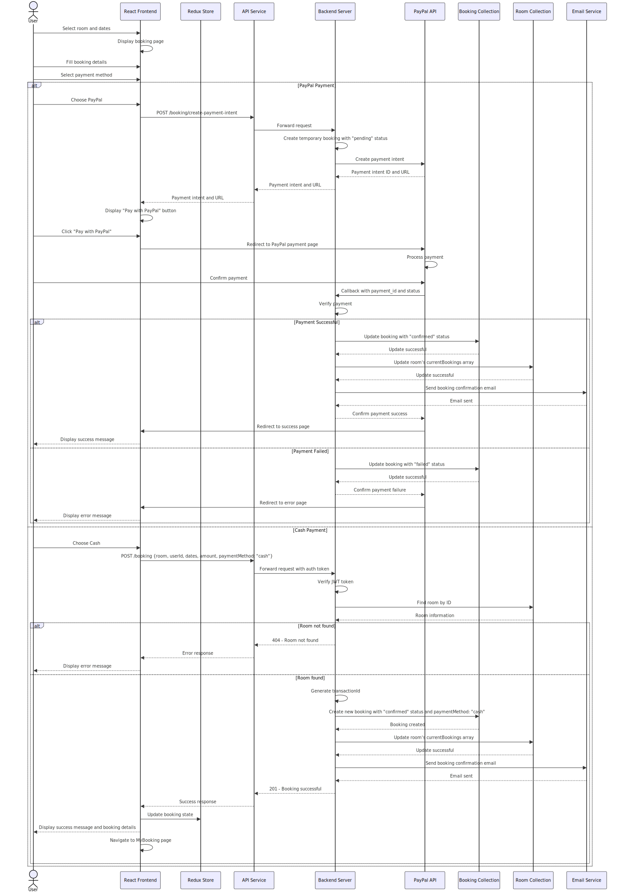

# Booking App Documentation

## Overview

This repository contains sequence diagrams and architectural documentation for a hotel booking application that supports both PayPal and cash payment methods.

## Sequence Diagrams

### Authentication & Authorization Flow



Illustrates the user authentication process and permission management within the system.

### Login Sequence



Details the process flow when users log into the application, including token generation and session management.

### Registration and Verification Sequence



Shows the complete user registration flow, including email verification steps.

### Room Booking Sequence



Documents the process of searching for, selecting, and booking hotel rooms.

### Payment Processing



Unified sequence diagram showing both PayPal and cash payment flows:

- Common initial steps for room selection and booking details
- PayPal integration with payment intent creation and callback handling
- Cash payment option with direct booking confirmation
- Success/failure paths for both payment methods
- Email notification system

## Architecture Documentation

### System Architecture



Provides a high-level overview of the application's components, services, and their interactions.

### Frontend Structure



Details the React component hierarchy, Redux store organization, and client-side routing.

## Implementation Details

The booking system implements:

- JWT-based authentication
- React frontend with Redux state management
- RESTful API services
- MongoDB database collections (Users, Rooms, Bookings, Payments)
- PayPal payment gateway integration
- Email notification service
- Responsive UI for multiple device types

## Getting Started

1. Clone the repository
2. Install dependencies with `npm install`
3. Configure environment variables for database and PayPal credentials
4. Run the development server with `npm run dev`

## Environment Variables

```
DB_URI=mongodb://localhost:27017/bookingApp
```

## API Endpoints

- `/api/auth` - Authentication endpoints
- `/api/rooms` - Room management endpoints
- `/api/bookings` - Booking creation and management
- `/api/payments` - Payment processing endpoints

## Technologies Used

- Frontend: React, Redux, React Router, PayPal SDK
- Backend: Node.js, Express
- Database: MongoDB
- Authentication: JWT
- Payment: PayPal API
